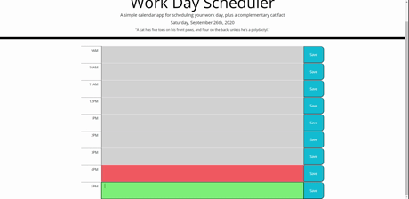

# Creating a Daily Scheduler Using jQuery & Moment.js

## Description

Using the jQuery and Moment.js libraries eases the workload of manipulating the DOM, making the process a lot less tedious. In addition to shortening the process of creating elements, I was also able to implement additional functionalities to the scheduler that would otherwise have been much more difficult to do writing the javaScript myself. For instance, the each() function allowed me to loop through an object and return its keys and values if needed. This was utilized in creating each row's time blocks. The each() function also allowed me to loop through specific elements, which is how I color coded each textarea. 

## Table of Contents
* Process
* Usage
* Credits
* Contributing
* License

## Process

The anonymous function defined within updateTime displays the current date at the top of the page. This was a big help in familiarizing myself with the Moment.js library. Next I initialized the object numLetts, assigning it key/value pairs of the hours needed in the scheduler app. This object were used to create the HTML elements. 

In the next section of the script I used each() to loop through the numLetts object. For each of the key/value pairs I created the elements used to render one time block row. I used the keys to create ID's for each row, and the values+Moment.js to display the hours for each hour block.

The next step was color-coding each block. Using each() I looped through all the textareas. For each loop I retrieved an ID that corresponded to a key in the numLetts object, allowing me to input the key's matching value as a parameter to a Moment.js call. I compared the current time to the top of each hour so that the color would accurate down to the second. At the bottom of my script I called this function every second so that the page wouldn't have to be refreshed in order to stay up-to-date.

Finally, I applied a click event listener to all the buttons. This would save anything typed into the textarea into local storage, using the row's ID as the key. If the textarea was blank it would delete the corresponding key from local storage. Again using each() the script loops through all textareas to retrieve and display text from local storage - this occurs when the page loads.

## Usage
To add an item to your schedule, simply type it into the text area and click the save button. The item will still be there if you close your browser and return to it later. To delete an item from your schedule, delete the text from the text area and click the save button. As you can see, grey blocks indicate past hours, the red block indicates the current hour, and green blocks indicate future hours. 

## Credits
The API used to generate random cat facts can be found below:

* [Github](https://github.com/alexwohlbruck/cat-facts)

* [Website](https://alexwohlbruck.github.io/cat-facts/)

## Contributing
[Contributor Covenant](https://www.contributor-covenant.org/)

## License
© 2019 Trilogy Education Services, a 2U, Inc. brand. All Rights Reserved.

Licensed under the [MIT](https://github.com/microsoft/vscode/blob/master/LICENSE.txt) License.
